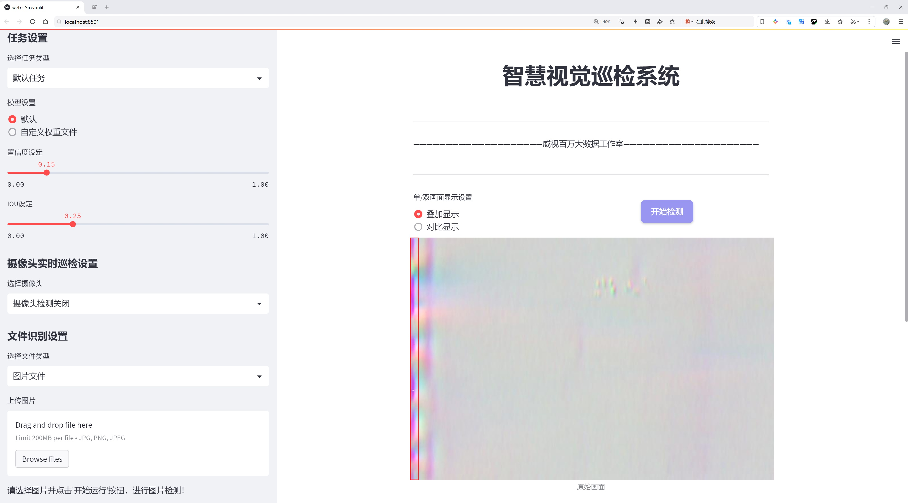
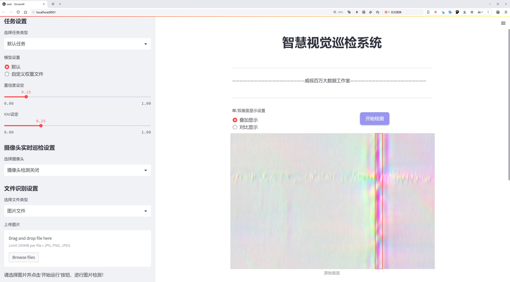
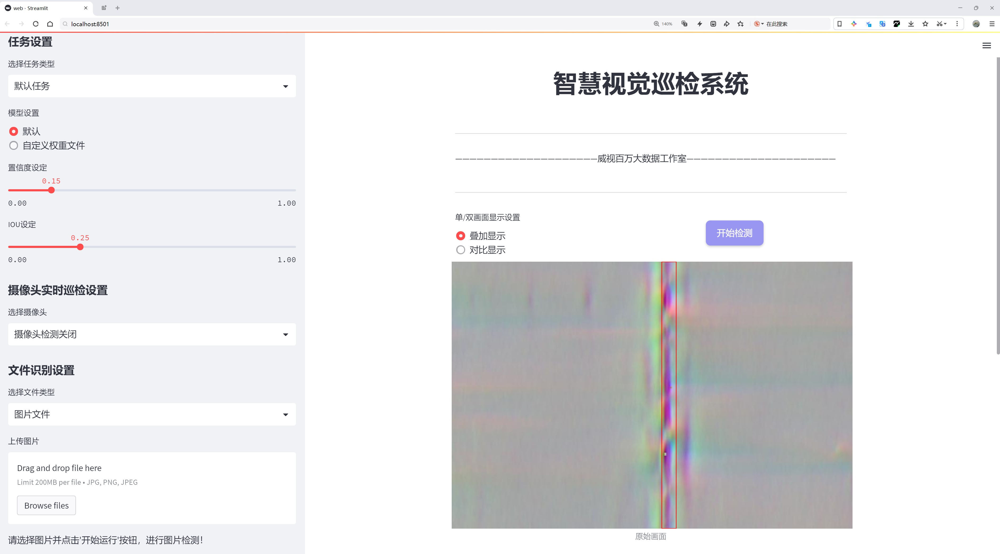
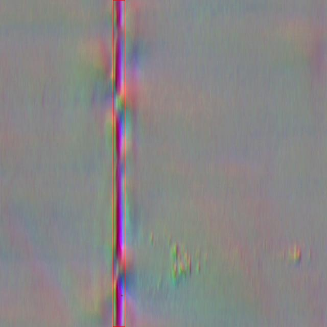
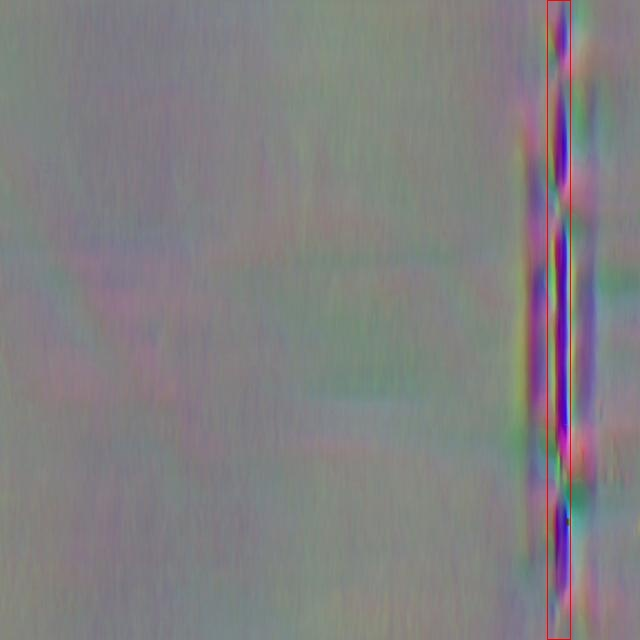
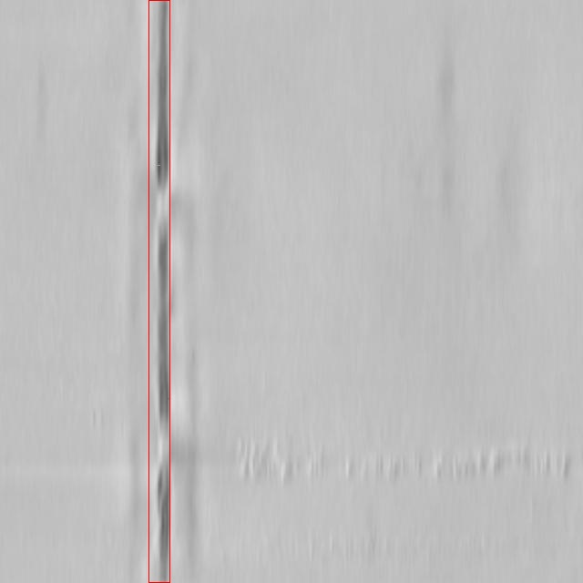
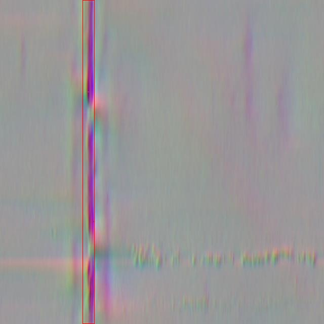

# 焊接缺陷检测检测系统源码分享
 # [一条龙教学YOLOV8标注好的数据集一键训练_70+全套改进创新点发刊_Web前端展示]

### 1.研究背景与意义

项目参考[AAAI Association for the Advancement of Artificial Intelligence](https://gitee.com/qunshansj/projects)

项目来源[AACV Association for the Advancement of Computer Vision](https://gitee.com/qunmasj/projects)

研究背景与意义

焊接作为一种广泛应用于制造业的重要连接工艺，其质量直接影响到产品的安全性和可靠性。随着工业自动化和智能制造的快速发展，传统的焊接缺陷检测方法逐渐暴露出效率低、准确性差等问题，亟需引入先进的计算机视觉技术以提升检测的智能化水平。近年来，深度学习技术在图像识别和目标检测领域取得了显著进展，尤其是YOLO（You Only Look Once）系列模型因其高效的实时检测能力而受到广泛关注。YOLOv8作为该系列的最新版本，具备更强的特征提取能力和更快的推理速度，为焊接缺陷检测提供了新的可能性。

在焊接过程中，常见的缺陷包括气孔、夹渣和焊缝不均等，这些缺陷不仅影响焊接接头的力学性能，还可能导致结构失效。因此，及时、准确地检测焊接缺陷对于保障产品质量至关重要。传统的人工检测方法不仅耗时耗力，而且容易受到人为因素的影响，导致漏检或误检现象的发生。基于深度学习的自动化检测系统能够通过大量数据的学习，自动识别和分类焊接缺陷，显著提高检测效率和准确性。

本研究基于改进的YOLOv8模型，构建了一套焊接缺陷检测系统。该系统利用一个包含2500张图像的数据集，涵盖了三类焊接缺陷：OSO（气孔）、TEE（夹渣）和WELD（焊缝不均）。通过对这些图像的深度学习训练，系统能够在复杂的焊接环境中快速、准确地识别和分类不同类型的缺陷。这不仅为焊接质量控制提供了强有力的技术支持，也为后续的智能制造和工业4.0的发展奠定了基础。

此外，随着数据集的不断扩展和模型的不断优化，基于YOLOv8的焊接缺陷检测系统有望在未来实现更高的检测精度和更广泛的应用场景。通过与其他传感器技术的结合，如红外成像、超声波检测等，形成多模态检测系统，可以进一步提升焊接缺陷检测的全面性和可靠性。这一研究不仅推动了焊接领域的技术进步，也为其他工业检测领域提供了借鉴，具有重要的学术价值和应用前景。

综上所述，基于改进YOLOv8的焊接缺陷检测系统的研究，不仅响应了工业自动化和智能制造的时代需求，也为焊接质量控制提供了新的解决方案，具有重要的理论意义和实际应用价值。通过深入探索深度学习在焊接缺陷检测中的应用，我们期望能够推动焊接技术的进步，提升制造业的整体水平。

### 2.图片演示







##### 注意：由于此博客编辑较早，上面“2.图片演示”和“3.视频演示”展示的系统图片或者视频可能为老版本，新版本在老版本的基础上升级如下：（实际效果以升级的新版本为准）

  （1）适配了YOLOV8的“目标检测”模型和“实例分割”模型，通过加载相应的权重（.pt）文件即可自适应加载模型。

  （2）支持“图片识别”、“视频识别”、“摄像头实时识别”三种识别模式。

  （3）支持“图片识别”、“视频识别”、“摄像头实时识别”三种识别结果保存导出，解决手动导出（容易卡顿出现爆内存）存在的问题，识别完自动保存结果并导出到tempDir中。

  （4）支持Web前端系统中的标题、背景图等自定义修改，后面提供修改教程。

  另外本项目提供训练的数据集和训练教程,暂不提供权重文件（best.pt）,需要您按照教程进行训练后实现图片演示和Web前端界面演示的效果。

### 3.视频演示

[3.1 视频演示](https://www.bilibili.com/video/BV1yZ4ZeYELd/)

### 4.数据集信息展示

##### 4.1 本项目数据集详细数据（类别数＆类别名）

nc: 3
names: ['OSO', 'TEE', 'WELD']


##### 4.2 本项目数据集信息介绍

数据集信息展示

在焊接缺陷检测领域，数据集的构建与应用至关重要。为此，我们引入了名为“CQDYK”的数据集，专门用于训练和改进YOLOv8模型，以实现高效、准确的焊接缺陷检测。该数据集的设计旨在涵盖焊接过程中可能出现的主要缺陷类型，进而提升自动化检测系统的性能和可靠性。

“CQDYK”数据集包含三种主要类别，分别为“OSO”（开口焊缝）、“TEE”（T型焊缝）和“WELD”（焊接接头）。这三种类别代表了焊接工艺中常见的缺陷类型，具有重要的实用价值。开口焊缝通常指的是焊接过程中未能完全填充的区域，可能导致结构强度不足；T型焊缝则是指在交叉焊接点可能出现的缺陷，影响连接的稳固性；而焊接接头则是焊接的关键部位，任何缺陷都可能对整体结构的安全性造成威胁。因此，准确识别和分类这些缺陷对于确保焊接质量和结构安全至关重要。

数据集“CQDYK”的构建过程中，采集了大量真实焊接场景下的图像数据，确保数据的多样性和代表性。这些图像不仅涵盖了不同类型的焊接缺陷，还包括了不同的焊接材料、工艺参数和环境条件。这种多样性使得模型在训练过程中能够学习到更为丰富的特征，从而在实际应用中表现出更强的泛化能力。此外，数据集中的每一张图像都经过精确标注，确保每个缺陷的类别和位置都能被准确识别，为模型的训练提供了坚实的基础。

在数据集的使用过程中，研究人员将“CQDYK”与YOLOv8模型相结合，利用其先进的深度学习算法进行焊接缺陷的检测与分类。YOLOv8作为一种高效的目标检测模型，能够在保证检测精度的同时，显著提高检测速度，适用于实时监控和工业应用场景。通过对“CQDYK”数据集的训练，模型能够在复杂的焊接环境中快速、准确地识别出不同类型的焊接缺陷，极大地提高了焊接质量检测的效率。

此外，为了进一步提升模型的性能，研究团队还对数据集进行了数据增强处理，包括旋转、缩放、裁剪等操作，以增加模型的鲁棒性。这些技术手段不仅丰富了训练数据的多样性，还有效防止了模型的过拟合现象，使得最终的检测系统在面对各种复杂情况时依然能够保持高水平的检测准确率。

总之，“CQDYK”数据集为焊接缺陷检测系统的研究与开发提供了重要的支持。通过与YOLOv8模型的结合，研究人员能够在焊接质量控制领域实现更高效、更智能的检测解决方案，为工业生产的安全性和可靠性提供了坚实保障。未来，随着数据集的不断扩展和模型的进一步优化，我们有理由相信焊接缺陷检测技术将迎来更为广阔的发展前景。










### 5.全套项目环境部署视频教程（零基础手把手教学）

[5.1 环境部署教程链接（零基础手把手教学）](https://www.ixigua.com/7404473917358506534?logTag=c807d0cbc21c0ef59de5)


[5.2 安装Python虚拟环境创建和依赖库安装视频教程链接（零基础手把手教学）](https://www.ixigua.com/7404474678003106304?logTag=1f1041108cd1f708b01a)

### 6.手把手YOLOV8训练视频教程（零基础小白有手就能学会）

[6.1 手把手YOLOV8训练视频教程（零基础小白有手就能学会）](https://www.ixigua.com/7404477157818401292?logTag=d31a2dfd1983c9668658)

### 7.70+种全套YOLOV8创新点代码加载调参视频教程（一键加载写好的改进模型的配置文件）

[7.1 70+种全套YOLOV8创新点代码加载调参视频教程（一键加载写好的改进模型的配置文件）](https://www.ixigua.com/7404478314661806627?logTag=29066f8288e3f4eea3a4)

### 8.70+种全套YOLOV8创新点原理讲解（非科班也可以轻松写刊发刊，V10版本正在科研待更新）

由于篇幅限制，每个创新点的具体原理讲解就不一一展开，具体见下列网址中的创新点对应子项目的技术原理博客网址【Blog】：


[8.1 70+种全套YOLOV8创新点原理讲解链接](https://gitee.com/qunmasj/good)

### 9.系统功能展示（检测对象为举例，实际内容以本项目数据集为准）

图9.1.系统支持检测结果表格显示

  图9.2.系统支持置信度和IOU阈值手动调节

  图9.3.系统支持自定义加载权重文件best.pt(需要你通过步骤5中训练获得)

  图9.4.系统支持摄像头实时识别

  图9.5.系统支持图片识别

  图9.6.系统支持视频识别

  图9.7.系统支持识别结果文件自动保存

  图9.8.系统支持Excel导出检测结果数据


### 10.原始YOLOV8算法原理

原始YOLOv8算法原理

YOLOv8模型是由Ultralytics团队在YOLOv5的基础上进行了一系列创新和改进后推出的最新目标检测算法。自2023年1月发布以来，YOLOv8凭借其在精度和速度上的显著提升，迅速成为目标检测领域的一个重要里程碑。YOLOv8的设计理念是将深度学习的最新研究成果与实际应用需求相结合，以实现更高效的目标检测。

在YOLOv8的网络结构中，主要分为输入层、主干网络、颈部网络和头部网络四个部分。输入层负责对输入图像进行预处理，包括图像缩放、数据增强等操作。YOLOv8在数据增强方面做出了创新，特别是对Mosaic数据增强的使用进行了优化。虽然Mosaic增强在提升模型鲁棒性和泛化能力方面表现良好，但过度使用可能会导致模型学习到不真实的特征。因此，YOLOv8在训练的最后10个epoch中停止使用Mosaic增强，以确保模型能够更好地捕捉真实数据的分布。

主干网络是YOLOv8的核心部分，其主要功能是通过卷积操作提取图像特征。与YOLOv5相比，YOLOv8在主干网络中将C3模块替换为C2f模块。C2f模块引入了YOLOv7中的ELAN思想，通过增加跳层连接来增强梯度流，这不仅提高了特征提取的效率，还使得模型的轻量化得以实现。SPPF（Spatial Pyramid Pooling Fusion）模块依然保留在主干网络中，继续发挥其在多尺度特征处理中的作用，同时减少了执行时间，提升了整体性能。

颈部网络则采用了路径聚合网络（PAN）结构，旨在有效融合不同尺度的特征图信息。YOLOv8在颈部网络中也将所有的C3模块替换为C2f模块，并删除了上采样之前的卷积连接层，以进一步简化网络结构，提升信息传递的效率。这种设计使得YOLOv8能够更好地处理各种尺度的目标，提高了对小目标的检测能力。

在头部网络中，YOLOv8采用了解耦的检测头结构，分别处理分类和回归任务。具体而言，YOLOv8通过两个并行的卷积分支来提取类别和位置特征。分类任务侧重于分析特征图中提取到的特征与已知类别的相似性，而定位任务则关注边界框与真实框之间的关系。这种解耦设计不仅提高了模型的收敛速度，还提升了预测的精度。此外，YOLOv8采用了无锚框结构，直接预测目标的中心位置，并引入了任务对齐学习（Task Alignment Learning，TAL）机制，以更好地区分正负样本。通过引入分类分数和IOU的高次幂乘积作为任务对齐程度的指标，YOLOv8在分类和定位损失函数中都考虑了这一指标，从而实现了更好的定位和分类性能。

在模型的检测效果上，YOLOv8在COCO数据集上的表现也令人瞩目。通过对比不同尺寸的模型，YOLOv8在保持参数量相对稳定的情况下，取得了更高的精度。同时，YOLOv8在推理速度上也表现出色，较其他YOLO系列模型在同尺寸下实现了更快的推理速度，且精度损失微乎其微。这使得YOLOv8在实时性和准确性之间找到了良好的平衡，尤其适合于需要快速响应的应用场景，如自动驾驶、安防监控等。

总的来说，YOLOv8模型在多个方面进行了创新和优化，使其在目标检测任务中展现出优越的性能。其结构设计充分考虑了模型的轻量化和高效性，适应了现代计算平台的需求，尤其是在移动设备和边缘计算环境中。随着YOLOv8的推广和应用，未来在垃圾目标检测、智能监控等领域的应用潜力将更加广阔。YOLOv8不仅是YOLO系列模型的又一次飞跃，更是目标检测技术发展的重要里程碑，展现了深度学习在实际应用中的巨大潜力和价值。


### 11.项目核心源码讲解（再也不用担心看不懂代码逻辑）

#### 11.1 code\ultralytics\data\explorer\explorer.py

以下是对代码的核心部分进行的分析和详细注释：

```python
# Ultralytics YOLO 🚀, AGPL-3.0 license

from io import BytesIO
from pathlib import Path
from typing import Any, List, Tuple, Union

import cv2
import numpy as np
import torch
from PIL import Image
from matplotlib import pyplot as plt
from pandas import DataFrame
from tqdm import tqdm

from ultralytics.data.augment import Format
from ultralytics.data.dataset import YOLODataset
from ultralytics.data.utils import check_det_dataset
from ultralytics.models.yolo.model import YOLO
from ultralytics.utils import LOGGER, IterableSimpleNamespace, checks

class ExplorerDataset(YOLODataset):
    def __init__(self, *args, data: dict = None, **kwargs) -> None:
        # 初始化ExplorerDataset，调用父类YOLODataset的构造函数
        super().__init__(*args, data=data, **kwargs)

    def load_image(self, i: int) -> Union[Tuple[np.ndarray, Tuple[int, int], Tuple[int, int]], Tuple[None, None, None]]:
        """从数据集中加载索引为'i'的图像，不进行任何调整大小操作。"""
        im, f, fn = self.ims[i], self.im_files[i], self.npy_files[i]
        if im is None:  # 如果图像未缓存到内存中
            if fn.exists():  # 如果存在npy文件，加载npy文件
                im = np.load(fn)
            else:  # 否则读取图像文件
                im = cv2.imread(f)  # 读取为BGR格式
                if im is None:
                    raise FileNotFoundError(f"Image Not Found {f}")  # 如果图像未找到，抛出异常
            h0, w0 = im.shape[:2]  # 获取原始高度和宽度
            return im, (h0, w0), im.shape[:2]  # 返回图像及其尺寸信息

        return self.ims[i], self.im_hw0[i], self.im_hw[i]  # 返回缓存的图像和尺寸信息

    def build_transforms(self, hyp: IterableSimpleNamespace = None):
        """创建数据集图像的转换，不进行调整大小。"""
        return Format(
            bbox_format="xyxy",  # 边界框格式
            normalize=False,  # 不进行归一化
            return_mask=self.use_segments,  # 是否返回分割掩码
            return_keypoint=self.use_keypoints,  # 是否返回关键点
            batch_idx=True,  # 返回批次索引
            mask_ratio=hyp.mask_ratio,  # 掩码比例
            mask_overlap=hyp.overlap_mask,  # 掩码重叠
        )

class Explorer:
    def __init__(self, data: Union[str, Path] = "coco128.yaml", model: str = "yolov8n.pt", uri: str = "~/ultralytics/explorer") -> None:
        # 检查所需的库是否安装
        checks.check_requirements(["lancedb>=0.4.3", "duckdb"])
        import lancedb

        self.connection = lancedb.connect(uri)  # 连接到LanceDB
        self.table_name = Path(data).name.lower() + "_" + model.lower()  # 生成表名
        self.sim_idx_base_name = f"{self.table_name}_sim_idx".lower()  # 相似索引的基本名称
        self.model = YOLO(model)  # 加载YOLO模型
        self.data = data  # 数据集路径
        self.choice_set = None  # 选择的数据集
        self.table = None  # 数据表
        self.progress = 0  # 进度

    def create_embeddings_table(self, force: bool = False, split: str = "train") -> None:
        """
        创建包含数据集中图像嵌入的LanceDB表。如果表已存在，则重用该表。
        """
        if self.table is not None and not force:
            LOGGER.info("Table already exists. Reusing it. Pass force=True to overwrite it.")
            return
        if self.table_name in self.connection.table_names() and not force:
            LOGGER.info(f"Table {self.table_name} already exists. Reusing it. Pass force=True to overwrite it.")
            self.table = self.connection.open_table(self.table_name)
            self.progress = 1
            return
        if self.data is None:
            raise ValueError("Data must be provided to create embeddings table")

        data_info = check_det_dataset(self.data)  # 检查数据集信息
        if split not in data_info:
            raise ValueError(f"Split {split} is not found in the dataset. Available keys in the dataset are {list(data_info.keys())}")

        choice_set = data_info[split]  # 获取指定分割的数据集
        choice_set = choice_set if isinstance(choice_set, list) else [choice_set]
        self.choice_set = choice_set
        dataset = ExplorerDataset(img_path=choice_set, data=data_info, augment=False, cache=False, task=self.model.task)

        # 创建表模式
        batch = dataset[0]
        vector_size = self.model.embed(batch["im_file"], verbose=False)[0].shape[0]  # 获取嵌入向量的维度
        table = self.connection.create_table(self.table_name, schema=get_table_schema(vector_size), mode="overwrite")  # 创建表
        table.add(
            self._yield_batches(
                dataset,
                data_info,
                self.model,
                exclude_keys=["img", "ratio_pad", "resized_shape", "ori_shape", "batch_idx"],
            )
        )

        self.table = table  # 保存表的引用

    def _yield_batches(self, dataset: ExplorerDataset, data_info: dict, model: YOLO, exclude_keys: List[str]):
        """生成用于嵌入的数据批次，排除指定的键。"""
        for i in tqdm(range(len(dataset))):
            self.progress = float(i + 1) / len(dataset)  # 更新进度
            batch = dataset[i]
            for k in exclude_keys:
                batch.pop(k, None)  # 移除不需要的键
            batch = sanitize_batch(batch, data_info)  # 清理批次数据
            batch["vector"] = model.embed(batch["im_file"], verbose=False)[0].detach().tolist()  # 计算嵌入向量
            yield [batch]  # 生成批次

    def query(self, imgs: Union[str, np.ndarray, List[str], List[np.ndarray]] = None, limit: int = 25) -> Any:
        """
        查询表以获取相似图像。接受单个图像或图像列表。
        """
        if self.table is None:
            raise ValueError("Table is not created. Please create the table first.")
        if isinstance(imgs, str):
            imgs = [imgs]  # 如果是单个图像路径，转换为列表
        assert isinstance(imgs, list), f"img must be a string or a list of strings. Got {type(imgs)}"
        embeds = self.model.embed(imgs)  # 计算图像的嵌入向量
        embeds = torch.mean(torch.stack(embeds), 0).cpu().numpy() if len(embeds) > 1 else embeds[0].cpu().numpy()  # 如果有多个图像，取平均
        return self.table.search(embeds).limit(limit).to_arrow()  # 查询相似图像并返回结果

    def sql_query(self, query: str, return_type: str = "pandas") -> Union[DataFrame, Any, None]:
        """
        在表上运行SQL查询。利用LanceDB的谓词下推。
        """
        assert return_type in {"pandas", "arrow"}, f"Return type should be either `pandas` or `arrow`, but got {return_type}"
        import duckdb

        if self.table is None:
            raise ValueError("Table is not created. Please create the table first.")

        table = self.table.to_arrow()  # 将表转换为Arrow格式
        if not query.startswith("SELECT") and not query.startswith("WHERE"):
            raise ValueError(f"Query must start with SELECT or WHERE. You can either pass the entire query or just the WHERE clause. found {query}")
        if query.startswith("WHERE"):
            query = f"SELECT * FROM 'table' {query}"  # 如果查询以WHERE开头，补全为SELECT语句
        LOGGER.info(f"Running query: {query}")

        rs = duckdb.sql(query)  # 执行查询
        if return_type == "arrow":
            return rs.arrow()  # 返回Arrow格式结果
        elif return_type == "pandas":
            return rs.df()  # 返回Pandas DataFrame格式结果

    def plot_sql_query(self, query: str, labels: bool = True) -> Image.Image:
        """
        绘制SQL查询结果的图像。
        """
        result = self.sql_query(query, return_type="arrow")
        if len(result) == 0:
            LOGGER.info("No results found.")
            return None
        img = plot_query_result(result, plot_labels=labels)  # 绘制查询结果
        return Image.fromarray(img)  # 返回图像

    def get_similar(self, img: Union[str, np.ndarray, List[str], List[np.ndarray]] = None, idx: Union[int, List[int]] = None, limit: int = 25, return_type: str = "pandas") -> Union[DataFrame, Any]:
        """
        查询表以获取相似图像。接受单个图像或图像列表。
        """
        assert return_type in {"pandas", "arrow"}, f"Return type should be either `pandas` or `arrow`, but got {return_type}"
        img = self._check_imgs_or_idxs(img, idx)  # 检查图像或索引
        similar = self.query(img, limit=limit)  # 查询相似图像

        if return_type == "arrow":
            return similar
        elif return_type == "pandas":
            return similar.to_pandas()  # 返回Pandas DataFrame格式结果

    def plot_similar(self, img: Union[str, np.ndarray, List[str], List[np.ndarray]] = None, idx: Union[int, List[int]] = None, limit: int = 25, labels: bool = True) -> Image.Image:
        """
        绘制相似图像。接受图像或索引。
        """
        similar = self.get_similar(img, idx, limit, return_type="arrow")
        if len(similar) == 0:
            LOGGER.info("No results found.")
            return None
        img = plot_query_result(similar, plot_labels=labels)  # 绘制相似图像
        return Image.fromarray(img)  # 返回图像

    def similarity_index(self, max_dist: float = 0.2, top_k: float = None, force: bool = False) -> DataFrame:
        """
        计算表中所有图像的相似性索引。
        """
        if self.table is None:
            raise ValueError("Table is not created. Please create the table first.")
        sim_idx_table_name = f"{self.sim_idx_base_name}_thres_{max_dist}_top_{top_k}".lower()
        if sim_idx_table_name in self.connection.table_names() and not force:
            LOGGER.info("Similarity matrix already exists. Reusing it. Pass force=True to overwrite it.")
            return self.connection.open_table(sim_idx_table_name).to_pandas()

        if top_k and not (1.0 >= top_k >= 0.0):
            raise ValueError(f"top_k must be between 0.0 and 1.0. Got {top_k}")
        if max_dist < 0.0:
            raise ValueError(f"max_dist must be greater than 0. Got {max_dist}")

        top_k = int(top_k * len(self.table)) if top_k else len(self.table)  # 计算top_k
        top_k = max(top_k, 1)
        features = self.table.to_lance().to_table(columns=["vector", "im_file"]).to_pydict()  # 获取特征
        im_files = features["im_file"]
        embeddings = features["vector"]

        sim_table = self.connection.create_table(sim_idx_table_name, schema=get_sim_index_schema(), mode="overwrite")  # 创建相似性索引表

        def _yield_sim_idx():
            """生成包含相似性索引和距离的数据框。"""
            for i in tqdm(range(len(embeddings))):
                sim_idx = self.table.search(embeddings[i]).limit(top_k).to_pandas().query(f"_distance <= {max_dist}")  # 查询相似图像
                yield [
                    {
                        "idx": i,
                        "im_file": im_files[i],
                        "count": len(sim_idx),
                        "sim_im_files": sim_idx["im_file"].tolist(),
                    }
                ]

        sim_table.add(_yield_sim_idx())  # 添加相似性索引数据
        self.sim_index = sim_table
        return sim_table.to_pandas()  # 返回相似性索引的DataFrame

    def plot_similarity_index(self, max_dist: float = 0.2, top_k: float = None, force: bool = False) -> Image:
        """
        绘制所有图像的相似性索引。
        """
        sim_idx = self.similarity_index(max_dist=max_dist, top_k=top_k, force=force)
        sim_count = sim_idx["count"].tolist()  # 获取相似图像计数
        sim_count = np.array(sim_count)

        indices = np.arange(len(sim_count))

        # 创建条形图
        plt.bar(indices, sim_count)

        # 自定义图表（可选）
        plt.xlabel("data idx")
        plt.ylabel("Count")
        plt.title("Similarity Count")
        buffer = BytesIO()
        plt.savefig(buffer, format="png")  # 保存图表到缓冲区
        buffer.seek(0)

        # 使用Pillow从缓冲区打开图像
        return Image.fromarray(np.array(Image.open(buffer)))  # 返回图像

    def _check_imgs_or_idxs(self, img: Union[str, np.ndarray, List[str], List[np.ndarray], None], idx: Union[None, int, List[int]]) -> List[np.ndarray]:
        """检查提供的图像或索引，确保至少提供一个。"""
        if img is None and idx is None:
            raise ValueError("Either img or idx must be provided.")
        if img is not None and idx is not None:
            raise ValueError("Only one of img or idx must be provided.")
        if idx is not None:
            idx = idx if isinstance(idx, list) else [idx]
            img = self.table.to_lance().take(idx, columns=["im_file"]).to_pydict()["im_file"]  # 根据索引获取图像

        return img if isinstance(img, list) else [img]  # 返回图像列表

    def ask_ai(self, query):
        """
        向AI提问。
        """
        result = prompt_sql_query(query)  # 生成SQL查询
        try:
            df = self.sql_query(result)  # 执行SQL查询
        except Exception as e:
            LOGGER.error("AI generated query is not valid. Please try again with a different prompt")
            LOGGER.error(e)
            return None
        return df  # 返回查询结果

    def visualize(self, result):
        """可视化查询结果。TODO。"""
        pass

    def generate_report(self, result):
        """生成数据集报告。TODO。"""
        pass
```

### 核心部分说明：
1. **ExplorerDataset 类**：负责加载图像数据集，支持从磁盘读取图像和生成图像的转换。
2. **Explorer 类**：核心功能类，负责创建嵌入表、查询相似图像、执行SQL查询、绘制结果等。
3. **create_embeddings_table 方法**：创建一个包含图像嵌入的数据库表。
4. **query 方法**：查询相似图像。
5. **sql_query 方法**：执行SQL查询并返回结果。
6. **similarity_index 方法**：计算相似性索引，返回每个图像的相似图像及其距离。

以上代码实现了一个图像处理和查询的框架，结合了YOLO模型进行图像嵌入和相似性搜索。

这个文件是一个名为 `explorer.py` 的 Python 脚本，属于 Ultralytics YOLO 项目，主要用于图像数据集的探索和处理。它包含了一个 `Explorer` 类和一个 `ExplorerDataset` 类，前者用于处理数据集的查询和相似性搜索，后者则是对 YOLO 数据集的扩展，提供图像加载和转换功能。

`ExplorerDataset` 类继承自 `YOLODataset`，其主要功能是加载图像并提供转换功能。`load_image` 方法用于从数据集中加载指定索引的图像，支持从缓存或文件中读取图像数据。`build_transforms` 方法则创建图像转换，允许用户在不改变图像大小的情况下进行数据增强。

`Explorer` 类是整个模块的核心，负责与 LanceDB 数据库进行交互。初始化时，它会检查所需的库是否已安装，并连接到指定的数据库。类中有多个方法用于创建图像嵌入表、查询相似图像、执行 SQL 查询、绘制查询结果等。`create_embeddings_table` 方法用于创建一个包含图像嵌入的数据库表，如果表已存在，可以选择覆盖。`query` 方法允许用户查询相似图像，支持单个或多个图像的输入，并返回相应的结果。

此外，`sql_query` 方法允许用户通过 SQL 语句查询数据库，支持返回 Pandas DataFrame 或 Arrow 表格格式。`plot_sql_query` 方法则用于可视化 SQL 查询的结果，返回一张包含查询结果的图像。`similarity_index` 方法计算所有图像的相似性索引，并返回一个包含相似图像信息的 DataFrame。

该类还提供了一些实用的可视化功能，例如 `plot_similarity_index` 方法用于绘制相似性索引的柱状图，展示每个图像的相似图像数量。`ask_ai` 方法允许用户通过自然语言查询图像数据，系统会将问题转换为 SQL 查询并返回结果。

总体而言，这个文件实现了一个功能强大的图像数据集探索工具，结合了深度学习模型的嵌入功能和数据库的高效查询能力，适用于需要处理和分析大量图像数据的场景。

#### 11.2 ui.py

以下是代码中最核心的部分，并附上详细的中文注释：

```python
import sys
import subprocess

def run_script(script_path):
    """
    使用当前 Python 环境运行指定的脚本。

    Args:
        script_path (str): 要运行的脚本路径

    Returns:
        None
    """
    # 获取当前 Python 解释器的路径
    python_path = sys.executable

    # 构建运行命令，使用 streamlit 运行指定的脚本
    command = f'"{python_path}" -m streamlit run "{script_path}"'

    # 执行命令
    result = subprocess.run(command, shell=True)
    # 检查命令执行的返回码，如果不为0，表示执行出错
    if result.returncode != 0:
        print("脚本运行出错。")

# 实例化并运行应用
if __name__ == "__main__":
    # 指定要运行的脚本路径
    script_path = "web.py"  # 这里可以直接指定脚本名

    # 调用函数运行脚本
    run_script(script_path)
```

### 代码注释说明：
1. **导入模块**：
   - `sys`：用于访问与 Python 解释器相关的变量和函数。
   - `subprocess`：用于创建新进程、连接到它们的输入/输出/错误管道，并获得返回码。

2. **定义 `run_script` 函数**：
   - 该函数接受一个参数 `script_path`，表示要运行的 Python 脚本的路径。
   - 使用 `sys.executable` 获取当前 Python 解释器的路径，以确保使用正确的 Python 环境。

3. **构建命令**：
   - 使用 f-string 构建命令字符串，调用 `streamlit` 模块运行指定的脚本。

4. **执行命令**：
   - 使用 `subprocess.run` 执行构建的命令，并通过 `shell=True` 允许在 shell 中执行命令。
   - 检查命令的返回码，如果返回码不为0，表示脚本运行出错，打印错误信息。

5. **主程序入口**：
   - 使用 `if __name__ == "__main__":` 确保只有在直接运行该脚本时才会执行以下代码。
   - 指定要运行的脚本路径，并调用 `run_script` 函数来执行该脚本。

这个程序文件名为 `ui.py`，其主要功能是使用当前的 Python 环境来运行一个指定的脚本，具体是一个名为 `web.py` 的文件。程序首先导入了必要的模块，包括 `sys`、`os` 和 `subprocess`，这些模块提供了与系统交互和执行外部命令的功能。此外，还导入了 `abs_path` 函数，用于获取文件的绝对路径。

在 `run_script` 函数中，首先获取当前 Python 解释器的路径，这样可以确保在正确的环境中运行脚本。接着，构建一个命令字符串，使用 `streamlit` 模块来运行指定的脚本。`streamlit` 是一个用于构建数据应用的库，命令中包含了脚本的路径。

然后，使用 `subprocess.run` 方法来执行构建好的命令。该方法会在一个新的 shell 中运行命令，并等待其完成。如果脚本运行返回的状态码不为零，表示出现了错误，程序会打印出相应的错误信息。

在文件的最后部分，使用 `if __name__ == "__main__":` 语句来确保当脚本直接运行时，以下代码才会被执行。此处指定了要运行的脚本路径为 `web.py`，并调用 `run_script` 函数来执行这个脚本。

总体而言，这个程序的设计目的是为了方便地运行一个 Streamlit 应用，通过封装在 `run_script` 函数中的逻辑，使得脚本的执行过程变得简单明了。

#### 11.3 70+种YOLOv8算法改进源码大全和调试加载训练教程（非必要）\ultralytics\models\utils\ops.py

以下是代码中最核心的部分，并附上详细的中文注释：

```python
import torch
import torch.nn as nn
import torch.nn.functional as F
from scipy.optimize import linear_sum_assignment
from ultralytics.utils.metrics import bbox_iou

class HungarianMatcher(nn.Module):
    """
    实现匈牙利匹配器的模块，用于解决预测框和真实框之间的分配问题。
    匈牙利匹配器通过一个成本函数来执行最优分配，考虑分类分数、边界框坐标等信息。
    """

    def __init__(self, cost_gain=None, use_fl=True, with_mask=False, num_sample_points=12544, alpha=0.25, gamma=2.0):
        """初始化匈牙利匹配器的参数，包括成本系数、Focal Loss、掩码预测等设置。"""
        super().__init__()
        if cost_gain is None:
            cost_gain = {'class': 1, 'bbox': 5, 'giou': 2, 'mask': 1, 'dice': 1}
        self.cost_gain = cost_gain  # 成本系数
        self.use_fl = use_fl  # 是否使用Focal Loss
        self.with_mask = with_mask  # 是否使用掩码预测
        self.num_sample_points = num_sample_points  # 掩码成本计算的采样点数量
        self.alpha = alpha  # Focal Loss中的alpha因子
        self.gamma = gamma  # Focal Loss中的gamma因子

    def forward(self, pred_bboxes, pred_scores, gt_bboxes, gt_cls, gt_groups, masks=None, gt_mask=None):
        """
        前向传播，计算预测框和真实框之间的匹配。
        计算分类成本、L1成本和GIoU成本，并根据这些成本找到最优匹配。
        """
        bs, nq, nc = pred_scores.shape  # 获取批次大小、查询数量和类别数量

        if sum(gt_groups) == 0:  # 如果没有真实框，返回空匹配
            return [(torch.tensor([], dtype=torch.long), torch.tensor([], dtype=torch.long)) for _ in range(bs)]

        # 将预测分数和边界框展平以计算成本矩阵
        pred_scores = pred_scores.detach().view(-1, nc)  # [batch_size * num_queries, num_classes]
        pred_scores = F.sigmoid(pred_scores) if self.use_fl else F.softmax(pred_scores, dim=-1)  # 应用激活函数
        pred_bboxes = pred_bboxes.detach().view(-1, 4)  # [batch_size * num_queries, 4]

        # 计算分类成本
        pred_scores = pred_scores[:, gt_cls]  # 选择与真实类别对应的预测分数
        if self.use_fl:  # 如果使用Focal Loss
            neg_cost_class = (1 - self.alpha) * (pred_scores ** self.gamma) * (-(1 - pred_scores + 1e-8).log())
            pos_cost_class = self.alpha * ((1 - pred_scores) ** self.gamma) * (-(pred_scores + 1e-8).log())
            cost_class = pos_cost_class - neg_cost_class  # 计算分类成本
        else:
            cost_class = -pred_scores  # 计算分类成本

        # 计算边界框之间的L1成本
        cost_bbox = (pred_bboxes.unsqueeze(1) - gt_bboxes.unsqueeze(0)).abs().sum(-1)  # (bs*num_queries, num_gt)

        # 计算边界框之间的GIoU成本
        cost_giou = 1.0 - bbox_iou(pred_bboxes.unsqueeze(1), gt_bboxes.unsqueeze(0), xywh=True, GIoU=True).squeeze(-1)

        # 最终成本矩阵
        C = self.cost_gain['class'] * cost_class + \
            self.cost_gain['bbox'] * cost_bbox + \
            self.cost_gain['giou'] * cost_giou

        # 处理掩码成本（如果有）
        if self.with_mask:
            C += self._cost_mask(bs, gt_groups, masks, gt_mask)

        # 将无效值（NaN和无穷大）设置为0
        C[C.isnan() | C.isinf()] = 0.0

        C = C.view(bs, nq, -1).cpu()  # 将成本矩阵重塑为 [batch_size, num_queries, num_gt]
        indices = [linear_sum_assignment(c[i]) for i, c in enumerate(C.split(gt_groups, -1))]  # 使用匈牙利算法计算匹配
        gt_groups = torch.as_tensor([0, *gt_groups[:-1]]).cumsum_(0)  # 计算真实框的累积和
        # 返回每个批次的匹配索引
        return [(torch.tensor(i, dtype=torch.long), torch.tensor(j, dtype=torch.long) + gt_groups[k])
                for k, (i, j) in enumerate(indices)]
```

### 代码核心部分说明：
1. **匈牙利匹配器的初始化**：设置了成本系数、是否使用Focal Loss、是否使用掩码预测等参数。
2. **前向传播方法**：计算预测框与真实框之间的匹配，涉及分类成本、L1成本和GIoU成本的计算。
3. **成本矩阵的构建**：将不同类型的成本结合起来，形成最终的成本矩阵。
4. **匈牙利算法**：使用`linear_sum_assignment`函数找到最优匹配。

通过这些步骤，匈牙利匹配器能够有效地解决目标检测中的分配问题。

该程序文件实现了一个名为 `HungarianMatcher` 的类，主要用于解决目标检测中的分配问题。它通过匈牙利算法在预测的边界框和真实的边界框之间进行最优匹配。该类的构造函数接受多个参数，包括成本系数、是否使用焦点损失、是否进行掩码预测、样本点数量以及焦点损失的超参数（alpha 和 gamma）。这些参数用于调整匹配过程中不同成本的权重。

在 `forward` 方法中，首先获取批次大小、查询数量和类别数量。如果当前批次没有真实目标，返回空的匹配结果。接着，将预测的得分和边界框进行扁平化处理，以便计算成本矩阵。分类成本通过预测得分和真实类别计算得出，使用焦点损失时，还会根据 alpha 和 gamma 进行调整。边界框之间的 L1 成本和广义 IoU 成本也会被计算。最终，所有成本会根据预设的权重组合成一个总成本矩阵。

接下来，使用 `linear_sum_assignment` 函数找到最优匹配的索引，并返回每个批次的匹配结果，包括预测框和真实框的索引。

此外，文件中还定义了一个 `get_cdn_group` 函数，用于创建对比去噪训练组。该函数从真实目标中生成正负样本，并对类别标签和边界框坐标施加噪声。函数接受多个参数，包括批次数据、类别数量、查询数量、类别嵌入等。根据输入的条件，函数返回修改后的类别嵌入、边界框、注意力掩码和元信息。

总的来说，该文件的核心功能是实现目标检测中的匹配机制，通过优化成本函数来提高模型的检测精度，同时提供对比去噪的训练方法，以增强模型的鲁棒性。

#### 11.4 70+种YOLOv8算法改进源码大全和调试加载训练教程（非必要）\ultralytics\nn\modules\utils.py

以下是代码中最核心的部分，并附上详细的中文注释：

```python
import torch
import torch.nn.functional as F

def multi_scale_deformable_attn_pytorch(value: torch.Tensor, value_spatial_shapes: torch.Tensor,
                                        sampling_locations: torch.Tensor,
                                        attention_weights: torch.Tensor) -> torch.Tensor:
    """
    多尺度可变形注意力机制。

    参数:
        value: 输入特征图，形状为 (bs, C, num_heads, embed_dims)，
               其中 bs 是批量大小，C 是通道数，num_heads 是头数，embed_dims 是每个头的维度。
        value_spatial_shapes: 特征图的空间形状，形状为 (num_levels, 2)，
                              每一行包含特征图的高度和宽度。
        sampling_locations: 采样位置，形状为 (bs, num_queries, num_heads, num_levels, num_points, 2)，
                           其中 num_queries 是查询的数量，num_levels 是特征图的层数，num_points 是每层的采样点数。
        attention_weights: 注意力权重，形状为 (bs, num_heads, num_queries, num_levels, num_points)。

    返回:
        output: 输出特征图，形状为 (bs, num_queries, num_heads * embed_dims)。
    """

    # 获取输入张量的形状
    bs, _, num_heads, embed_dims = value.shape
    _, num_queries, _, num_levels, num_points, _ = sampling_locations.shape

    # 将输入特征图根据空间形状拆分成多个特征图
    value_list = value.split([H_ * W_ for H_, W_ in value_spatial_shapes], dim=1)

    # 将采样位置转换到[-1, 1]的范围
    sampling_grids = 2 * sampling_locations - 1
    sampling_value_list = []

    # 遍历每个特征图层
    for level, (H_, W_) in enumerate(value_spatial_shapes):
        # 对特征图进行重塑和转置以适应后续的采样
        value_l_ = (value_list[level].flatten(2).transpose(1, 2).reshape(bs * num_heads, embed_dims, H_, W_))

        # 获取当前层的采样网格
        sampling_grid_l_ = sampling_grids[:, :, :, level].transpose(1, 2).flatten(0, 1)

        # 使用双线性插值从特征图中采样
        sampling_value_l_ = F.grid_sample(value_l_,
                                          sampling_grid_l_,
                                          mode='bilinear',
                                          padding_mode='zeros',
                                          align_corners=False)
        sampling_value_list.append(sampling_value_l_)

    # 处理注意力权重
    attention_weights = attention_weights.transpose(1, 2).reshape(bs * num_heads, 1, num_queries,
                                                                  num_levels * num_points)

    # 计算最终输出
    output = ((torch.stack(sampling_value_list, dim=-2).flatten(-2) * attention_weights).sum(-1).view(
        bs, num_heads * embed_dims, num_queries))

    return output.transpose(1, 2).contiguous()  # 返回转置后的输出
```

### 代码说明：
1. **输入参数**：
   - `value`：输入特征图，包含多个头的特征信息。
   - `value_spatial_shapes`：特征图的空间维度信息，用于拆分特征图。
   - `sampling_locations`：指定从特征图中采样的位置。
   - `attention_weights`：每个采样点的注意力权重。

2. **功能**：
   - 该函数实现了多尺度可变形注意力机制，通过从不同尺度的特征图中采样，并根据注意力权重加权组合这些采样结果，最终生成输出特征图。

3. **核心步骤**：
   - 将输入特征图根据空间形状拆分。
   - 将采样位置转换到[-1, 1]的范围。
   - 使用双线性插值从特征图中采样。
   - 计算加权和以生成最终输出特征图。

这个程序文件是Ultralytics YOLO的一部分，主要包含了一些实用的工具函数，用于深度学习模型的构建和训练。代码中使用了PyTorch库，涉及到模块的克隆、权重初始化、反sigmoid函数的计算以及多尺度可变形注意力机制的实现。

首先，文件中定义了一个 `_get_clones` 函数，该函数用于从给定的模块创建多个克隆模块，返回一个包含这些克隆模块的 `ModuleList`。这种方法在构建神经网络时非常有用，尤其是在需要重复使用相同结构的情况下。

接下来，`bias_init_with_prob` 函数用于根据给定的先验概率初始化卷积或全连接层的偏置值。这个函数通过计算偏置的初始值，使得在训练开始时模型的输出更符合预期的概率分布。

`linear_init_` 函数则是用于初始化线性模块的权重和偏置。它使用均匀分布在一个特定的范围内对权重进行初始化，并且如果模块有偏置，则同样对偏置进行初始化。这种初始化方法有助于加速模型的收敛。

`inverse_sigmoid` 函数计算给定张量的反sigmoid函数。它首先将输入限制在0到1之间，然后通过计算logit值来返回结果。这个函数在某些模型中用于处理概率值的转换。

最后，`multi_scale_deformable_attn_pytorch` 函数实现了多尺度可变形注意力机制。该函数接受多个输入，包括值张量、空间形状、采样位置和注意力权重。它通过对输入进行一系列的张量操作，计算出多尺度的注意力输出。这个函数的实现细节包括对输入张量的重塑、转置和使用双线性插值进行采样等操作，最终返回一个经过注意力加权的输出张量。

总体来说，这个文件提供了一些基础的工具函数，旨在支持YOLOv8模型的构建和训练，尤其是在处理复杂的注意力机制时。这些函数的设计考虑了模块的可重用性和初始化的有效性，为后续的模型训练提供了良好的基础。

#### 11.5 code\ultralytics\utils\callbacks\neptune.py

以下是代码中最核心的部分，并附上详细的中文注释：

```python
# 导入必要的库
from ultralytics.utils import LOGGER, SETTINGS, TESTS_RUNNING

# 尝试导入NeptuneAI库并进行初始化
try:
    assert not TESTS_RUNNING  # 确保不在测试运行中
    assert SETTINGS["neptune"] is True  # 确保Neptune集成已启用
    import neptune
    from neptune.types import File

    assert hasattr(neptune, "__version__")  # 确保Neptune库版本存在

    run = None  # NeptuneAI实验记录实例

except (ImportError, AssertionError):
    neptune = None  # 如果导入失败，则将neptune设置为None


def _log_scalars(scalars, step=0):
    """将标量数据记录到NeptuneAI实验记录器中。"""
    if run:  # 如果NeptuneAI实例已初始化
        for k, v in scalars.items():  # 遍历标量字典
            run[k].append(value=v, step=step)  # 记录标量值和步骤


def _log_images(imgs_dict, group=""):
    """将图像记录到NeptuneAI实验记录器中。"""
    if run:  # 如果NeptuneAI实例已初始化
        for k, v in imgs_dict.items():  # 遍历图像字典
            run[f"{group}/{k}"].upload(File(v))  # 上传图像文件


def on_pretrain_routine_start(trainer):
    """在训练例程开始之前调用的回调函数。"""
    try:
        global run
        # 初始化Neptune运行
        run = neptune.init_run(project=trainer.args.project or "YOLOv8", name=trainer.args.name, tags=["YOLOv8"])
        # 记录超参数配置
        run["Configuration/Hyperparameters"] = {k: "" if v is None else v for k, v in vars(trainer.args).items()}
    except Exception as e:
        LOGGER.warning(f"WARNING ⚠️ NeptuneAI安装但未正确初始化，未记录此运行。 {e}")


def on_train_epoch_end(trainer):
    """每个训练周期结束时调用的回调函数。"""
    # 记录训练损失和学习率
    _log_scalars(trainer.label_loss_items(trainer.tloss, prefix="train"), trainer.epoch + 1)
    _log_scalars(trainer.lr, trainer.epoch + 1)
    if trainer.epoch == 1:  # 如果是第一个周期
        # 记录训练批次的图像
        _log_images({f.stem: str(f) for f in trainer.save_dir.glob("train_batch*.jpg")}, "Mosaic")


def on_train_end(trainer):
    """训练结束时调用的回调函数。"""
    if run:  # 如果NeptuneAI实例已初始化
        # 记录最终结果和混淆矩阵、PR图
        files = [
            "results.png",
            "confusion_matrix.png",
            "confusion_matrix_normalized.png",
            *(f"{x}_curve.png" for x in ("F1", "PR", "P", "R")),
        ]
        # 过滤存在的文件
        files = [(trainer.save_dir / f) for f in files if (trainer.save_dir / f).exists()]
        for f in files:
            _log_plot(title=f.stem, plot_path=f)  # 记录图表
        # 记录最终模型
        run[f"weights/{trainer.args.name or trainer.args.task}/{trainer.best.name}"].upload(File(str(trainer.best)))


# 定义回调函数集合，如果Neptune未初始化则为空
callbacks = (
    {
        "on_pretrain_routine_start": on_pretrain_routine_start,
        "on_train_epoch_end": on_train_epoch_end,
        "on_fit_epoch_end": on_fit_epoch_end,
        "on_val_end": on_val_end,
        "on_train_end": on_train_end,
    }
    if neptune
    else {}
)
```

### 代码说明：
1. **NeptuneAI初始化**：代码首先尝试导入NeptuneAI库并进行初始化，以便记录实验数据。如果导入失败，则将`neptune`设置为`None`，后续的记录操作将不会执行。

2. **记录标量和图像**：定义了两个核心函数`_log_scalars`和`_log_images`，用于将训练过程中的标量数据（如损失和学习率）和图像（如训练批次图像）记录到NeptuneAI中。

3. **回调函数**：定义了一系列回调函数（如`on_pretrain_routine_start`、`on_train_epoch_end`、`on_train_end`等），这些函数在训练的不同阶段被调用，以记录相应的训练信息。

4. **回调集合**：最后，创建一个包含所有回调函数的字典，如果Neptune未初始化，则该字典为空。这使得在训练过程中可以灵活地调用相应的记录函数。

这个程序文件是用于与NeptuneAI进行集成的回调函数，主要用于在训练YOLO模型时记录实验数据和结果。文件首先导入了一些必要的模块和库，并尝试初始化NeptuneAI的实验记录器。如果NeptuneAI未正确安装或未启用，则会捕获异常并将`neptune`设置为`None`。

文件中定义了一些私有函数，主要用于记录不同类型的数据到NeptuneAI中。`_log_scalars`函数用于记录标量数据，例如损失值和学习率；`_log_images`函数用于记录图像数据，通常是训练过程中生成的图像；`_log_plot`函数用于记录绘图数据，如训练结果的可视化图。

接下来，文件定义了一些回调函数，这些函数会在特定的训练阶段被调用。`on_pretrain_routine_start`函数在训练开始前被调用，用于初始化NeptuneAI的实验记录器并记录超参数配置。`on_train_epoch_end`函数在每个训练周期结束时被调用，记录训练损失和学习率，并在第一轮结束时记录训练批次的图像。`on_fit_epoch_end`函数在每个训练和验证周期结束时被调用，记录模型的配置信息和指标。`on_val_end`函数在每次验证结束时被调用，记录验证集的图像。`on_train_end`函数在训练结束时被调用，记录最终的结果，包括混淆矩阵和其他性能曲线，并上传最佳模型的权重。

最后，文件定义了一个`callbacks`字典，如果NeptuneAI可用，则将之前定义的回调函数添加到字典中，以便在训练过程中被调用。这些回调函数提供了一种灵活的方式来记录和监控模型训练的各个阶段。

#### 11.6 train.py

以下是经过简化和注释的核心代码部分：

```python
import random
import numpy as np
import torch.nn as nn
from ultralytics.data import build_dataloader, build_yolo_dataset
from ultralytics.engine.trainer import BaseTrainer
from ultralytics.models import yolo
from ultralytics.nn.tasks import DetectionModel
from ultralytics.utils import LOGGER, RANK
from ultralytics.utils.torch_utils import de_parallel, torch_distributed_zero_first

class DetectionTrainer(BaseTrainer):
    """
    基于检测模型的训练类，继承自BaseTrainer类。
    """

    def build_dataset(self, img_path, mode="train", batch=None):
        """
        构建YOLO数据集。

        参数:
            img_path (str): 包含图像的文件夹路径。
            mode (str): 模式，'train'表示训练模式，'val'表示验证模式。
            batch (int, optional): 批次大小，适用于'rect'模式。默认为None。
        """
        gs = max(int(de_parallel(self.model).stride.max() if self.model else 0), 32)
        return build_yolo_dataset(self.args, img_path, batch, self.data, mode=mode, rect=mode == "val", stride=gs)

    def get_dataloader(self, dataset_path, batch_size=16, rank=0, mode="train"):
        """构造并返回数据加载器。"""
        assert mode in ["train", "val"]
        with torch_distributed_zero_first(rank):  # 在分布式训练中，确保数据集只初始化一次
            dataset = self.build_dataset(dataset_path, mode, batch_size)
        shuffle = mode == "train"  # 训练模式下打乱数据
        workers = self.args.workers if mode == "train" else self.args.workers * 2
        return build_dataloader(dataset, batch_size, workers, shuffle, rank)  # 返回数据加载器

    def preprocess_batch(self, batch):
        """对图像批次进行预处理，包括缩放和转换为浮点数。"""
        batch["img"] = batch["img"].to(self.device, non_blocking=True).float() / 255  # 归一化图像
        if self.args.multi_scale:  # 如果启用多尺度
            imgs = batch["img"]
            sz = (
                random.randrange(self.args.imgsz * 0.5, self.args.imgsz * 1.5 + self.stride)
                // self.stride
                * self.stride
            )  # 随机选择新的图像大小
            sf = sz / max(imgs.shape[2:])  # 计算缩放因子
            if sf != 1:
                ns = [
                    math.ceil(x * sf / self.stride) * self.stride for x in imgs.shape[2:]
                ]  # 计算新的形状
                imgs = nn.functional.interpolate(imgs, size=ns, mode="bilinear", align_corners=False)  # 调整图像大小
            batch["img"] = imgs
        return batch

    def get_model(self, cfg=None, weights=None, verbose=True):
        """返回YOLO检测模型。"""
        model = DetectionModel(cfg, nc=self.data["nc"], verbose=verbose and RANK == -1)
        if weights:
            model.load(weights)  # 加载权重
        return model

    def plot_training_samples(self, batch, ni):
        """绘制带有注释的训练样本。"""
        plot_images(
            images=batch["img"],
            batch_idx=batch["batch_idx"],
            cls=batch["cls"].squeeze(-1),
            bboxes=batch["bboxes"],
            paths=batch["im_file"],
            fname=self.save_dir / f"train_batch{ni}.jpg",
            on_plot=self.on_plot,
        )

    def plot_metrics(self):
        """从CSV文件中绘制指标。"""
        plot_results(file=self.csv, on_plot=self.on_plot)  # 保存结果图
```

### 代码说明：
1. **类定义**：`DetectionTrainer`类继承自`BaseTrainer`，用于处理YOLO模型的训练过程。
2. **数据集构建**：`build_dataset`方法根据输入路径和模式构建YOLO数据集。
3. **数据加载器**：`get_dataloader`方法构造数据加载器，支持分布式训练。
4. **批处理预处理**：`preprocess_batch`方法对输入图像批次进行归一化和尺寸调整。
5. **模型获取**：`get_model`方法返回YOLO检测模型，并可选择加载预训练权重。
6. **绘图功能**：`plot_training_samples`和`plot_metrics`方法用于可视化训练样本和训练指标。

这个程序文件 `train.py` 是一个用于训练目标检测模型的脚本，主要基于 YOLO（You Only Look Once）模型。它继承自 `BaseTrainer` 类，专注于构建和训练 YOLO 模型。文件中包含了多个方法，每个方法负责不同的功能，以下是对代码的详细说明。

首先，文件导入了一些必要的库和模块，包括数学运算、随机数生成、深度学习框架 PyTorch 相关的模块，以及 Ultralytics 提供的用于数据处理、模型构建和训练的工具。

`DetectionTrainer` 类是这个文件的核心，包含了多个方法来实现训练过程中的各个步骤。`build_dataset` 方法用于构建 YOLO 数据集，接受图像路径、模式（训练或验证）和批次大小作为参数。它使用 `build_yolo_dataset` 函数来创建数据集，并根据模式设置不同的增强方式。

`get_dataloader` 方法用于构建数据加载器，确保在分布式训练时只初始化一次数据集。它根据模式决定是否打乱数据，并设置工作线程的数量。这个方法返回一个可以迭代的数据加载器，用于在训练过程中批量加载数据。

`preprocess_batch` 方法负责对图像批次进行预处理，包括将图像缩放到适当的大小并转换为浮点数格式。该方法还支持多尺度训练，通过随机选择图像大小来增强模型的鲁棒性。

`set_model_attributes` 方法用于设置模型的属性，包括类别数量和类别名称等。这些信息是训练过程中所需的超参数。

`get_model` 方法返回一个 YOLO 检测模型实例，可以选择加载预训练权重。这个方法确保模型的配置与数据集的类别数量一致。

`get_validator` 方法返回一个用于验证模型性能的验证器。它会记录损失值，包括边界框损失、类别损失和分布损失等。

`label_loss_items` 方法用于返回带有标签的训练损失项字典，便于在训练过程中跟踪损失变化。

`progress_string` 方法生成一个格式化的字符串，显示训练进度，包括当前的 epoch、GPU 内存使用情况、损失值、实例数量和图像大小等信息。

`plot_training_samples` 方法用于绘制训练样本及其标注，帮助可视化训练数据的质量。它将图像、类别和边界框等信息传递给 `plot_images` 函数进行绘制。

最后，`plot_metrics` 和 `plot_training_labels` 方法用于绘制训练过程中的指标和标签，帮助分析模型的训练效果和数据分布。

总体来说，这个 `train.py` 文件实现了一个完整的目标检测模型训练流程，涵盖了数据集构建、数据加载、模型训练、损失计算和结果可视化等多个方面。

### 12.系统整体结构（节选）

### 整体功能和构架概括

整个程序的功能是实现一个基于 YOLOv8 的目标检测系统，涵盖了数据处理、模型训练、评估和可视化等多个方面。程序的结构模块化，主要分为以下几个部分：

1. **数据处理**：包括数据集的构建、加载和预处理，确保训练和验证过程中能够高效地读取和处理图像数据。
2. **模型构建**：实现 YOLOv8 模型的构建和初始化，支持加载预训练权重。
3. **训练过程**：提供训练的主要逻辑，包括损失计算、模型更新和训练进度监控。
4. **评估与可视化**：在训练和验证过程中记录指标，支持可视化训练样本、损失曲线和其他性能指标。
5. **回调机制**：集成了多种回调函数，用于记录实验数据、监控训练过程和支持与外部工具（如 Neptune 和 TensorBoard）的集成。

### 文件功能整理表

| 文件路径                                                                                         | 功能描述                                                                                      |
|--------------------------------------------------------------------------------------------------|-----------------------------------------------------------------------------------------------|
| `code\ultralytics\data\explorer\explorer.py`                                                   | 实现图像数据集的探索工具，支持相似性搜索和数据查询，结合深度学习模型的嵌入功能。               |
| `code\ui.py`                                                                                    | 运行 Streamlit 应用，提供一个简单的界面来展示模型训练和结果。                                |
| `70+种YOLOv8算法改进源码大全和调试加载训练教程（非必要）\ultralytics\models\utils\ops.py`       | 实现匈牙利匹配算法，处理目标检测中的分配问题，并提供对比去噪训练组的生成。                     |
| `70+种YOLOv8算法改进源码大全和调试加载训练教程（非必要）\ultralytics\nn\modules\utils.py`      | 提供深度学习模型的工具函数，包括模块克隆、权重初始化和多尺度可变形注意力机制的实现。          |
| `code\ultralytics\utils\callbacks\neptune.py`                                                  | 集成 NeptuneAI，用于记录训练过程中的实验数据和结果，支持可视化和监控。                      |
| `train.py`                                                                                      | 实现 YOLO 模型的训练流程，包括数据集构建、模型训练、损失计算和结果可视化。                   |
| `code\ultralytics\data\dataset.py`                                                              | 处理数据集的加载和预处理，提供数据增强和批量加载功能。                                       |
| `70+种YOLOv8算法改进源码大全和调试加载训练教程（非必要）\ultralytics\models\yolo\classify\__init__.py` | 初始化 YOLO 分类模型模块，提供分类相关的功能和接口。                                          |
| `code\ultralytics\hub\__init__.py`                                                             | 提供模型的加载和管理功能，支持从 Ultralytics Hub 下载和使用模型。                             |
| `70+种YOLOv8算法改进源码大全和调试加载训练教程（非必要）\ultralytics\trackers\utils\__init__.py` | 初始化跟踪器模块，提供目标跟踪相关的功能和接口。                                              |
| `code\ultralytics\trackers\utils\gmc.py`                                                      | 实现全局运动补偿（GMC）算法，用于提高目标跟踪的准确性和鲁棒性。                               |
| `70+种YOLOv8算法改进源码大全和调试加载训练教程（非必要）\ultralytics\utils\plotting.py`        | 提供可视化工具，绘制训练过程中的指标、损失曲线和样本图像等。                                   |
| `70+种YOLOv8算法改进源码大全和调试加载训练教程（非必要）\ultralytics\utils\callbacks\tensorboard.py` | 集成 TensorBoard，用于记录和可视化训练过程中的指标和损失，便于分析模型性能。                  |

这个表格总结了每个文件的主要功能，展示了整个项目的模块化结构和各部分之间的协作关系。

注意：由于此博客编辑较早，上面“11.项目核心源码讲解（再也不用担心看不懂代码逻辑）”中部分代码可能会优化升级，仅供参考学习，完整“训练源码”、“Web前端界面”和“70+种创新点源码”以“13.完整训练+Web前端界面+70+种创新点源码、数据集获取”的内容为准。

### 13.完整训练+Web前端界面+70+种创新点源码、数据集获取


# [下载链接：https://mbd.pub/o/bread/ZpuVkpZw](https://mbd.pub/o/bread/ZpuVkpZw)